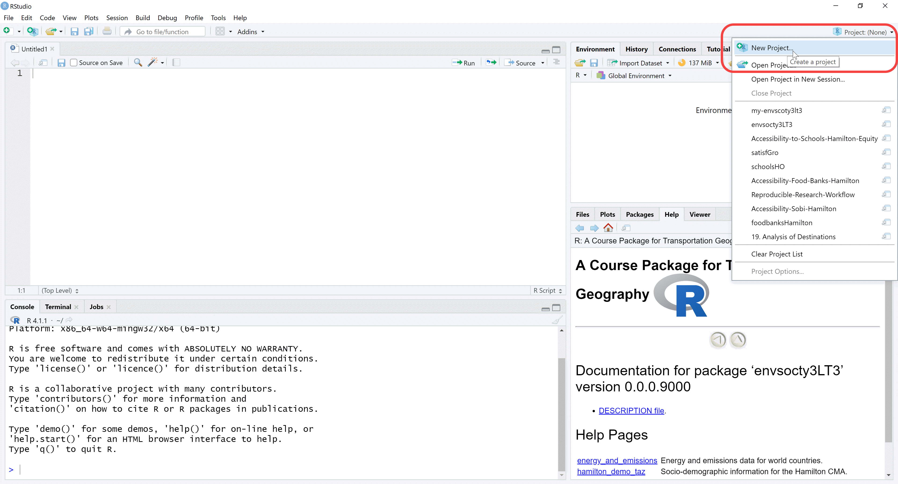
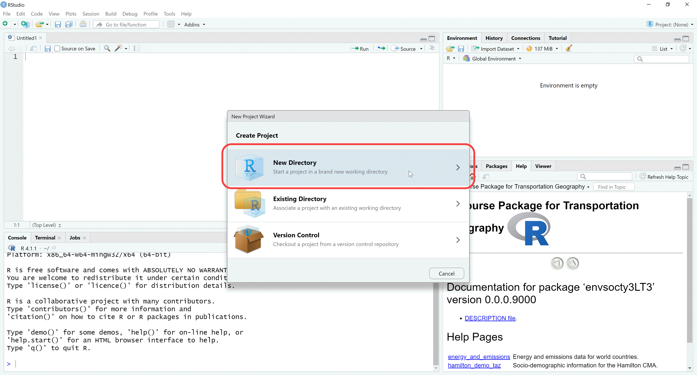

<!-- README.md is generated from README.Rmd. Please edit that file -->

```{r, include = FALSE}
knitr::opts_chunk$set(
  collapse = TRUE,
  comment = "#>",
  fig.path = "man/figures/README-",
  out.width = "100%"
)
```

# envsocty3LT3

<!-- badges: start -->
[](https://lifecycle.r-lib.org/articles/stages.html#experimental)
[](https://CRAN.R-project.org/package=envsocty3LT3)
<!-- Institutional logo: save in folder `images` -->

<!-- badges: end -->

Package `envsocty3LT3` is an open educational resource that aims to combine various advantages of working with the [`R` statistical computing project](https://www.r-project.org/):

- Ease of distribution
- Reproducibility
- Availability of templates for computational notebooks
- Rigor in documentation of data sets and computational products

This course package is designed for use in the course [ENVSOCTY 3LT3 _Transportation Geography_](https://academiccalendars.romcmaster.ca/preview_course_nopop.php?catoid=41&coid=221967) offered by the [School of Earth, Environment and Society](https://www.science.mcmaster.ca/ees/) at [McMaster University](https://www.mcmaster.ca/). The course package includes the following components:

- Document templates with **Readings**. 
- Document templates with **Exercises**.
- Data sets used in the Readings and Exercises.
- Custom functions.

## What do I need to use the course package?

This course does not assume knowledge of, or experience working with `R`. So no previous knowledge is required, other than some experience using computers in general, and maybe a word processor (e.g., Microsoft Word) and spreadsheets (e.g., Microsoft Excel). To use the package you will begin from the very basics: how to install and use the necessary software.

###	`R`: The open statistical computing project

What is `R`?

`R` is an open-source language for statistical computing. It was created in the early 1990s by [Ross Ihaka](https://en.wikipedia.org/wiki/Ross_Ihaka) and [Robert Gentleman](https://en.wikipedia.org/wiki/Robert_Gentleman_(statistician)) at the University of Auckland, New Zealand, as a way to provide their students with an accessible, no-cost statistical application for their courses. `R` is now maintained by the `R` Development Core Team, and it continues to be developed by hundreds of contributors around the globe. `R` is an attractive alternative to other software packages for data analysis (e.g., Microsoft Excel, Matlab, Stata, ArcGIS) due to its open-source character (i.e., it is free), its flexibility, and large user community. The size of the `R` community means that if there is something you want to do (for instance, estimate a linear regression model or plot geographical information), it is very likely that someone has already developed a package for it.

A good way to think about `R` is as a core package, with a library of optional packages can be attached to increase its core functionality. `R` can be downloaded for free at:

https://cran.rstudio.com/

`R` comes with a built-in console (a user graphical interface), but better alternatives to the basic interface include RStudio, which can also be downloaded for free:

https://www.rstudio.com/products/rstudio/download/

`R` requires you to work using the command line, which is going to be unfamiliar to many of you accustomed to user-friendly graphical interfaces. Do not fear. People worked for a long time using the command line, or using even more cumbersome systems, such as punched cards in early computers. Graphical user interfaces are convenient, but they have a major drawback, namely their inflexibility. A program that functions based on graphical user interfaces allows you to do only what is hard-coded in the user interface. Command line, as you will soon discover, is somewhat more involved, but provides much more flexibility in operation, and the ability to be more creative.

To begin, install `R` and RStudio in your computer. This [video](https://www.youtube.com/watch?v=gZh91IdIMts) (5:23 min) shows how to install these application. 

If you are working in the GIS lab at McMaster you will find that these have already been installed there. If you have used `R` and have a previous instal, update it to `R` version 4.1.1 (2021-08-10) -- "Kick Things". **The course package was developed using “Kick Things”!**

### RStudio window: A Quick Tour

RStudio is an _Interactive Development Environment_ (IDE for short). It takes the form of a familiar window application, and it provides a complete interface to interact with the language `R`. The application consists of a window with toolbars and several panes. Some panes include in addition several tabs. There are the usual drop-down menus for common operations. See Figure 1 below.

```{r echo=FALSE, fig.cap="Figure 1. RStudio IDE"}

```


<!--  -->

The editor pane allows you to open and work with text and other files. In these files you can write instructions that can be passed on to `R` for execution. Writing something in the editor does not execute the instructions, it merely records them for possible future use.

The console pane is where instructions are passed on to the program. When an instruction is typed (or copied and pasted) there, `R` will understand that it needs to do something. The instructions must be written in a way that `R` understands, otherwise errors will occur.

The top-right pane includes a tab for the environment; this is where all data objects that are currently in memory are reported. The History tab in the same pane acts like a log: it keeps track of all instructions that have been executed in the console. Depending on your project, you may see other tabs there.

The last pane in the bottom-right includes a few other useful tabs. The File tab allows you to navigate directories in your computer, change the working directory, see what files are where, and so on. The Plot tab is where plots are rendered, when instructions require `R` to do so. The Packages tab allows you to manage packages, which as mentioned above, are pieces of code that can augment the functionality of `R`. The Help tab is where you can consult the documentation for functions/packages/see examples, and so on. The Viewer tab is for displaying web content locally. Many `R` functions create html output and it is in this pane where this kind of content can be previewed.

## Quick Start Guide

Once you have installed `R` and RStudio you are ready to install the course package `envsocty3LT3`. The package is available from [GitHub](https://github.com/paezha/envsocty3LT3), and to install it you need to run the following code in your `R` console:

``` r
remotes::install_github("paezha/envsocty3LT3")
```

This will download the package to your personal library of packages and install it to make the package available for use locally.

## Recommended Workflow

After installing the course package, this is the recommended workflow for using it in this course.

Create a project for all your work in this course.

```{r echo=FALSE, fig.cap="Figure 2. Create new project - option 1"}
knitr::include_graphics("images/02-Create-Project-1.png")
```

```{r echo=FALSE, fig.cap="Figure 3. Create new project - option 2"}

```

```{r echo=FALSE, fig.cap="Figure 4. Choose to create the project in a new directory"}

```

```{r echo=FALSE, fig.cap="Figure 5. Choose the type of project to create: new directory for your project"}
knitr::include_graphics("images/05-Create-Project-Empty-Directory.png")
```

```{r echo=FALSE, fig.cap="Figure 6. Create your project"}
knitr::include_graphics("images/06-Create-Project.png")
```

```{r echo=FALSE, fig.cap="Figure 7. Admire your brand new project"}
knitr::include_graphics("images/07-New-Project.png")
```

